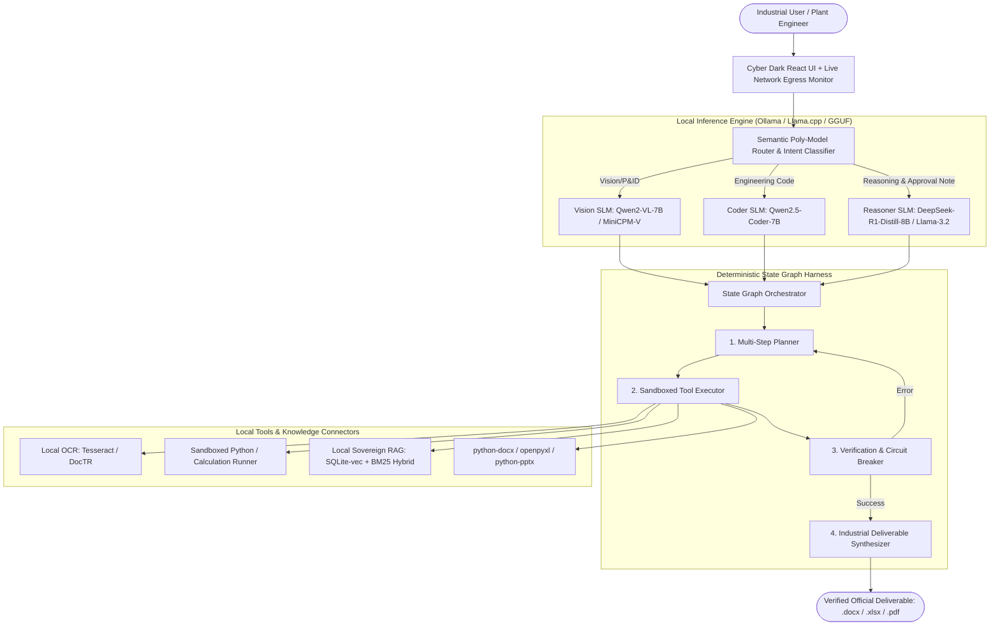

# MRPL Problem Statement 26117 — Architectural Specification
## Project: Sovereign On-Premise Agentic AI Workbench for Industrial Operations

---

## 1. Executive Summary & Problem Framing
- **Client/Organization:** Mangalore Refinery and Petrochemicals Limited (MRPL)
- **Problem Statement ID:** `26117` (ISH260117)
- **Domain:** Smart Automation / Sovereign AI / Industrial Knowledge Systems
- **Core Mission:** Deliver a 100% air-gapped, self-hosted, multi-model agentic AI workbench running locally on enterprise GPU/CPU hardware. The system executes complex multi-step industrial knowledge tasks (P&ID review, scanned report digestion, approval note drafting, sandboxed engineering calculations) without a single byte leaving the local network.

---

## 2. Core Architectural Pillars

---

## 3. High-Value Industrial Deliverables
1. **PSU Standard Approval Notes (`.docx`)**: Formal multi-tier notes (Subject, Background, Proposal, Financial Implication, Delegation of Power authority, Recommendation).
2. **P&ID & Scanned Inspection Parser**: Visual anomaly detection on piping diagrams, valve status verification, and OCR extraction of handwritten inspection logs.
3. **Sandboxed Engineering Calculator**: Execution of thermodynamic / fluid / structural formulas with step-by-step intermediate verification logs.
4. **Live Sovereign Air-Gap Monitor**: Visual real-time packet sniffer proving 0 outbound DNS/HTTP packets outside `127.0.0.1`.

---

## 4. Team Work Breakdown & Delegation Matrix (6 Members)

| Role | Member | Key Responsibilities | Concrete Deliverables |
| :--- | :--- | :--- | :--- |
| **Lead & Architect** | **Bhanu Teja** | State Graph DAG, Semantic Router, Pitch Deck & Live Demo Flow | `state_graph.py`, `semantic_router.py`, Master Presentation |
| **Backend & Security** | Member 2 | FastAPI Server, Air-gap Network Egress Logger, Tool API Harness | `server.py`, `network_monitor.py`, `/api/tools/*` |
| **AI / SLM Engineer** | Member 3 | GGUF Quantization, Model Registry, Local Inference Pipeline | `model_loader.py` (Ollama/llama.cpp bindings) |
| **Frontend & UX** | Member 4 | Industrial Dark Mode UI, Live Thought Graph, Artifact Previewer | React + Vite UI, Cytoscape/React-Flow DAG Visualizer |
| **Evals & Sandboxing**| Member 5 | PyTest Challenger-Judge Suite, Sandboxed Execution Runner | `sandbox.py`, `eval_suite.py`, failure recovery tests |
| **Data & RAG Lead** | Member 6 | Hybrid Vector Search (BM25 + sqlite-vec), Docx/Xlsx Exporters | `sovereign_rag.py`, `deliverable_generator.py` |
